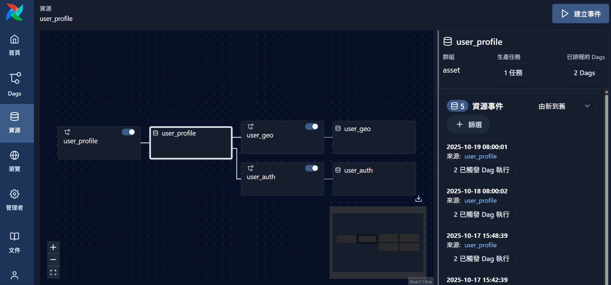

# Airflow Assets

## 一、什麼是 Airflow Assets？

在傳統 Airflow 中，我們以 **DAG（Directed Acyclic Graph）** 來表示一系列任務的執行流程，例如資料擷取 → 清理 → 輸出。但在資料工程或分析場景中，我們更關注的是「**資料資產 (Data Assets)**」之間的**血緣與更新關係**，這種關係更像是「資料表或檔案之間的依賴」，而非「任務之間的順序」。
因此，**Airflow Assets** 功能的核心理念是：

> 將資料本身（表格、檔案、模型、指標等）視為 Airflow 的一級公民 (First-class Citizen)。
> 簡單來說: DAG 關心「怎麼做」，而 Assets 關心「資料變了沒」。



---

## 二、Assets 的核心用途

| 功能面向                    | 說明                              | 範例                                          |
| ----------------------- | ------------------------------- | ------------------------------------------- |
| **資料血緣 (Data Lineage)** | 自動追蹤資料產出與消費的來源，建立可視化依賴圖         | `user_profile → user_geo → user_auth`       |
| **事件觸發 (Event-driven)** | 當上游資產更新時，自動觸發下游更新流程             | 每日更新 `user_profile` 時觸發其他資產 materialization |
| **版本控制 (Versioning)**   | 每次 materialization 都會記錄時間戳與執行狀態 | 可在 UI 右側「資源事件」中查看                           |
| **跨 DAG 管理**            | 相同資產可被多個 DAG 共享，Airflow 會統一追蹤   | `user_profile` 可能同時被 ETL 與分析流程使用            |

---

## 三、`@asset` 裝飾器的角色

在 Airflow SDK 中，`@asset` 是用來定義「資產」的 decorator，類似於 `@dag` 定義流程、`@task` 定義任務。每個被 `@asset` 裝飾的函式代表一個**資料節點**。

### `@asset` 基本語法

```python
@asset(
    schedule="@daily",       # 決定此資產多久 materialize 一次
    uri="db://user_profile", # 資產儲存位置，可為資料表、檔案、API 等
    tags=["user", "profile"] # 自訂標籤，方便分類或搜尋
)
def user_profile(context):
    ...
```

---

### 常見參數與用途

| 參數名稱       | 型別             | 說明                                                            |
| ---------- | -------------- | ------------------------------------------------------------- |
| `schedule` | `str` 或 `None` | 指定排程頻率，例如 `@daily`、`@hourly`。若設為 `None`，代表僅由上游觸發。             |
| `uri`      | `str`          | 資產的唯一識別符，可對應實際資料位置，例如 `db://table_name` 或 `s3://bucket/path`。 |
| `upstream` | `list[Asset]`  | 定義此資產依賴的上游資產。Airflow 會根據此設定自動繪出血緣圖。                           |
| `tags`     | `list[str]`    | 自訂分類標籤，如 `raw`、`clean`、`model`。                               |

---

## 四、Assets 與 DAG 的對比

| 面向         | DAG                 | Assets                   |
| ---------- | ------------------- | ------------------------ |
| **核心單位**   | 任務 (Task)           | 資產 (Asset)               |
| **用途焦點**   | 工作流程控制（依序執行）        | 資料血緣與更新關係追蹤              |
| **可視化重點**  | 任務依賴圖               | 資料依賴圖（上游/下游關係）           |
| **觸發機制**   | 時間排程、外部觸發           | 上游資產 materialization 事件  |
| **最佳應用場景** | ETL pipeline、模型訓練流程 | Data Lake、DW、特徵表、BI 指標更新 |

---

## 五、UI 行為與觀察重點

在 Airflow UI 的「資源 (Assets)」頁面中：

* 每個資產以節點形式顯示，可視化上下游依賴。
* 右側面板會列出最近的 **Asset Events**（時間、來源、觸發的 DAG 數量）。
* 當上游資產完成 materialization 時，Airflow 會自動觸發所有相依的下游節點。

例如：

```
2025-10-19 08:00:01  來源：user_profile
→ 已觸發 2 個 DAG 執行
```

代表 `user_profile` 資產的更新同時觸發了 `user_geo` 與 `user_auth` 的 materialization。

---

## 六、總結

Airflow SDK 的 **Assets 概念**讓使用者不再只思考「任務順序」，而是以「資料產出與傳遞」為核心。搭配 `@asset` 裝飾器，可以：

1. 建立清晰的資料血緣圖與依賴關係。
2. 自動追蹤每個資料節點的更新與事件。
3. 統一管理資料管線的素材、輸入與輸出。


