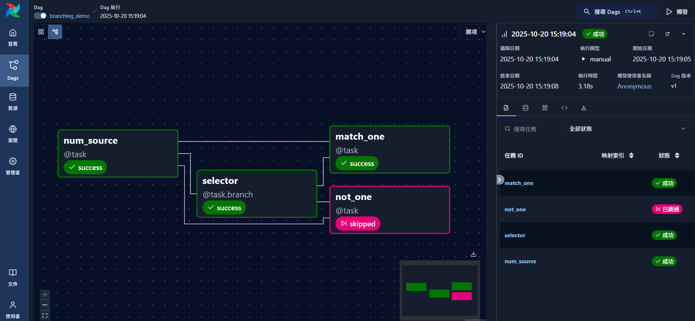

# Airflow Branching

本文介紹 Airflow SDK 中的 **Branching**（條件分支）機制，用於根據上游任務的輸出動態決定下游任務的執行路徑。這一功能讓 DAG 能夠模擬邏輯判斷流程，例如 IF/ELSE 條件，常用於多路決策或依條件執行不同任務。

---

## 🧭 一、Branching 概念

在 Airflow 中，**Branching** 是指：

> 由上游任務根據條件決定下游任務中哪一個（或哪幾個）會被執行，其餘自動標記為 `skipped`。

此機制讓 DAG 能動態改變執行流程，例如：

* 依資料驗證結果決定是否啟動主流程
* 根據日期或環境變數選擇不同任務
* 在多版本任務之間做條件切換（A/B path）

---

## ⚙️ 二、使用方法

Airflow SDK 提供 `@task.branch` decorator 來建立分支任務。該任務需**回傳欲執行任務的 task_id**（或 list of task_ids）。

**語法重點：**

```python
@task.branch
def selector(...):
    if condition:
        return "task_a"
    return "task_b"
```

* 當返回單一字串 → 僅執行對應任務。
* 當返回多個 task_id（list）→ 可同時執行多個任務。
* 未被選中的任務將自動標記為 `skipped`。

---

## 🧩 三、完整範例：Branching Demo



```python
from airflow.sdk import dag, task

@dag(
    description="Demonstration of conditional branching in Airflow SDK.",
    tags=["basic", "branching"],
)
def branching_demo():
    """DAG 主體：展示分支條件與任務選擇邏輯。"""

    # (1) 數值來源任務 ----------------------------------------------------
    @task
    def num_source() -> int:
        """產生整數作為分支依據。"""
        return 1

    # (2) 分支決策任務 ----------------------------------------------------
    @task.branch
    def selector(num: int) -> str:
        """根據傳入數值選擇後續要執行的任務。

        - 若 num == 1 → 執行 match_one
        - 否則 → 執行 not_one

        Airflow 根據回傳的 task_id 只會啟動對應任務，
        其他任務自動標記為 skipped。
        """
        if num == 1:
            return "match_one"
        return "not_one"

    # (3) 分支任務 1 ------------------------------------------------------
    @task
    def match_one(num: int):
        print(f"Number equals {num}.")

    # (4) 分支任務 2 ------------------------------------------------------
    @task
    def not_one(num: int):
        print(f"Number differs from one: {num}")

    # ---- 任務依賴設定 ----------------------------------------------------
    value = num_source()
    selector(value) >> [match_one(value), not_one(value)]

# ---- 註冊 DAG -------------------------------------------------------------
branching_demo()
```

---

## 🔍 四、DAG 執行邏輯

| 任務名稱         | 功能說明         | 狀態行為              |
| ------------ | ------------ | ----------------- |
| `num_source` | 產生輸入值        | always success    |
| `selector`   | 根據輸入決定路徑     | returns task_id   |
| `match_one`  | 僅當 num==1 執行 | success 或 skipped |
| `not_one`    | 僅當 num!=1 執行 | success 或 skipped |

在 Airflow UI 的 Graph View 中，可以明顯看到非選中分支呈現灰色（狀態 `skipped`）。

---

## 💡 五、常見應用場景

| 類型      | 說明                            |
| ------- | ----------------------------- |
| 條件式任務   | 根據變數或外部輸入決定執行哪條任務路徑           |
| 測試與生產分流 | Dev / Prod pipeline 自動切換不同任務集 |
| 異常分流    | 若上游驗證失敗 → 執行通知任務、跳過後續主流程      |
| 多版本控制   | 同一 DAG 內含舊版與新版任務分支            |

---

## 🧠 六、進階說明

* 若要讓所有分支之後再回到同一任務，可使用 `TriggerRule=any_success` 結合 join 任務。
* 若需多層判斷，可串接多個 `@task.branch` 任務（但不建議過度複雜化）。
* Airflow 也提供 `BranchPythonOperator` 給傳統 DAG 使用，邏輯相同。

---

> ✅ **總結**：Branching 是 Airflow 控制流程的關鍵功能之一，讓 DAG 能根據運行條件動態決策執行路徑，適合在多情境、條件化或異常分流任務中使用。
