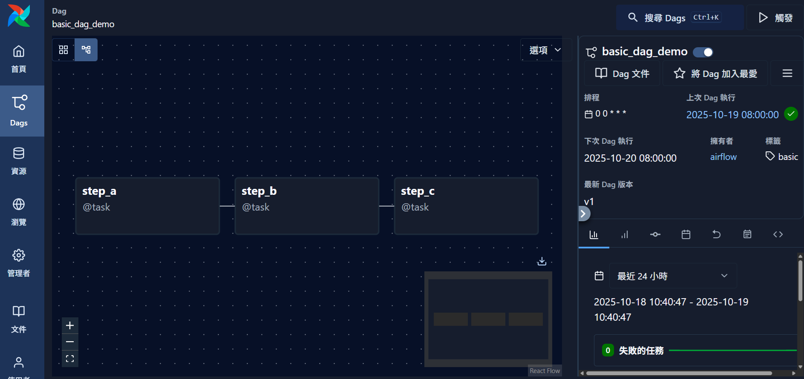

## Airflow dags

**2025.10.20**

[DAG（Directed Acyclic Graph）](https://airflow.apache.org/docs/apache-airflow/stable/core-concepts/dags.html) 是 Apache Airflow 的核心概念，代表一組具有依賴關係的任務集合。每個 DAG 就是一個「工作流程 (Workflow)」，由多個任務 (Tasks) 組成，並按照拓樸順序執行。

例如，一個資料處理的工作流程可能包含：

```
step_a → step_b → step_c
```

這三個任務形成一個 DAG，其中箭頭代表任務的依賴方向。



```python
from airflow.sdk import dag, task
from pendulum import datetime
from datetime import timedelta

@dag(
    dag_id="basic_dag_demo",
    start_date=datetime(2025,1,1),
    schedule="@daily",
    catchup=False,
    default_args={"retries": 1, "retry_delay": timedelta(minutes=3)},
    tags=["demo", "tutorial"],
)
def basic_dag_demo():

    @task(task_id="step_a")
    def step_a():
        return 1

    @task(task_id="step_b")
    def step_b(x):
        return x + 1

    @task(task_id="step_c")
    def step_c():
        print("Done!")

    b = step_b(step_a())
    b >> step_c()

basic_dag_demo()
```

在 Airflow SDK 中，`@dag` 與 `@task` 是最核心的兩個 decorator，用於定義整個工作流程（DAG）與其中的任務（Task）。
* **`@dag`**：定義整個資料流程的結構（排程、依賴、說明、metadata）。
* **`@task`**：定義具體的工作步驟（Python 函式即為任務）。


### `@dag` 參數說明

| 參數名稱           | 型別                  | 說明                                     | 範例                                                   |
| -------------- | ------------------- | -------------------------------------- | ---------------------------------------------------- |
| `dag_id`       | `str`               | DAG 的唯一識別名稱，預設為函式名稱                    | `@dag(dag_id="basic_dag_demo")`                      |
| `start_date`   | `datetime`          | DAG 的邏輯起始日期，Airflow 依據此日期建立排程點         | `start_date=datetime(2025,1,1)`                      |
| `schedule`     | `str` 或 `timedelta` | DAG 的排程頻率，可使用 [cron 表達式](cron_expression.md)或預設排程字串          | `schedule="@daily"`、`schedule="0 8 * * *"`           |
| `catchup`      | `bool`              | 是否補執行過去未執行的排程點，預設為 `True`              | `catchup=False`                                      |
| `default_args` | `dict`              | 提供任務的共用設定，如 `retries`, `retry_delay` 等 | `default_args={"retries":1}`                         |
| `tags`         | `list[str]`         | 於 UI 顯示的 DAG 標籤，方便搜尋                   | `tags=["basic"]`                                     |
| `description`  | `str`               | DAG 的描述文字                              | `description="Demo DAG with three sequential tasks"` |

---

### `@task` 參數說明

| 參數名稱               | 型別          | 說明                            | 範例                                              |
| ------------------ | ----------- | ----------------------------- | ----------------------------------------------- |
| `task_id`          | `str`       | 任務名稱，預設為函式名稱                  | `@task(task_id="step_a")`                       |
| `retries`          | `int`       | 任務失敗後重試次數                     | `retries=2`                                     |
| `retry_delay`      | `timedelta` | 重試間隔時間                        | `retry_delay=timedelta(minutes=5)`              |
| `depends_on_past`  | `bool`      | 是否依賴前一次執行結果，常用於遞增式任務          | `depends_on_past=False`                         |
| `do_xcom_push`     | `bool`      | 是否將回傳值推送到 XCom，用於任務間資料傳遞      | `do_xcom_push=True`                             |
| `multiple_outputs` | `bool`      | 是否將 dict 轉為多個 XCom 值          | `multiple_outputs=True`                         |
| `executor_config`  | `dict`      | 設定自訂的執行環境（如資源限制、K8s labels 等） | `executor_config={"KubernetesExecutor": {...}}` |

---

### 在 Airflow UI 的 DAG 頁面中，可切換不同視圖：

| 視圖類型           | 功能                |
| -------------- | ----------------- |
| **Graph View** | 顯示任務之間的依賴結構（最常用）。 |
| **Grid View**  | 顯示任務執行歷史與狀態分布。    |
| **Tree View**  | 樹狀結構顯示任務狀態。       |
| **Gantt View** | 顯示任務執行時間與平行性。     |

### 資料流（Task Dependencies）

Airflow SDK 使用 Python 運算子（`>>`、`<<`）或函式參數回傳機制建立任務之間的依賴關係。

#### 1️⃣ 運算子方式

使用 `>>`（下游）與 `<<`（上游）運算子可顯式設定任務執行順序：

```python
step_a >> step_b >> step_c
```

等同於：

```python
step_a.set_downstream(step_b)
step_b.set_downstream(step_c)
```

這樣 Airflow 就會依序執行 `step_a → step_b → step_c`。

---

#### 2️⃣ 函式參數方式（推薦）

當使用 Airflow SDK decorator（`@task`）時，可以直接透過函式呼叫參數建立依賴：

```python
@task
def step_a():
    return 1

@task
def step_b(x):
    return x + 1

@task
def step_c(y):
    print(f"Final output: {y}")

b = step_b(step_a())
step_c(b)
```

此時 `step_b` 自動依賴於 `step_a`，`step_c` 依賴於 `step_b`。Airflow 會自動解析函式間的 XComArg 依賴，不需手動設定。

---

### 函式與 XCom 傳遞

在 Airflow SDK 模式下：

* 每個被 `@task` 裝飾的函式會轉為 **任務（Task）**。
* 任務的回傳值會自動存入 **XCom（Cross Communication）**，供下游任務使用。

例如：

```python
@task
def get_number():
    return 42

@task
def multiply(n):
    return n * 2

result = multiply(get_number())
```

此例中：

* `get_number()` 的回傳值 `42` 會被推送至 XCom。
* `multiply()` 的輸入參數 `n` 會自動從 XCom 取得。

> 💡 **重點**：
> Airflow SDK 會在背後建立 **XComArg** 物件，而非立即執行函式；
> 真正的值會在任務執行階段由 scheduler 傳遞。