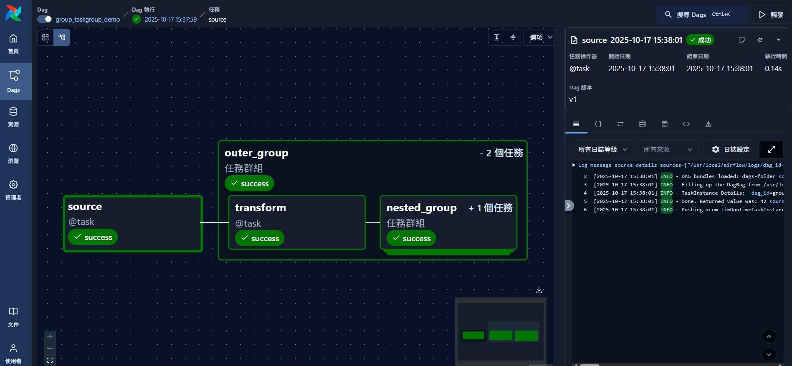

# TaskGroups (任務群組)

**2025.10.22**

**目的：** TaskGroup 是 Airflow 中用於組織任務結構的機制，讓 DAG 在視覺上與邏輯上更有層次性。它能將多個相關任務歸為一個群組，形成類似「模組化」的結構，方便維護與閱讀。TaskGroup 可巢狀使用，支援獨立的參數與重試策略。

---

## 🧭 一、概念簡介

在傳統 Airflow DAG 中，若包含數十個任務，UI 上會顯得擁擠與難以閱讀。透過 `TaskGroup`，可將邏輯相關的任務打包成一個群組，視覺化時只顯示為可展開的方塊，讓 DAG 更有層次感。

**常見用途：**

* 將資料處理流程拆成「擷取 → 轉換 → 輸出」三個群組。
* 將不同模型訓練步驟歸類於單一群組。
* 在同一群組內統一設定重試次數、失敗策略等。

---

## 🧩 二、語法結構

在 SDK（TaskFlow API）中，可使用 `@task_group()` decorator 直接定義群組。群組可接受 `default_args`（例如 retries）或其他屬性，並在群組內建立多個任務或巢狀群組。

### ✅ 基本語法

```python
from airflow.sdk import dag, task, task_group

@dag(description="Example DAG with TaskGroup")
def my_dag():

    @task_group(default_args={"retries": 2})
    def group_a():
        @task
        def step1():
            print("A1 done")
        @task
        def step2():
            print("A2 done")
        step1() >> step2()

    group_a()
```

---

## 🔁 三、巢狀結構範例

以下範例展示外層與巢狀 TaskGroup 的使用方式，並示範群組層級的重試設定：



```python
from airflow.sdk import dag, task, task_group

@dag(
    description="Nested TaskGroup example with retry settings.",
    tags=["basic", "taskgroup"],
)
def group_taskgroup_demo():
    """DAG 主體：展示外層與巢狀 TaskGroup 的使用方式。"""

    @task
    def source() -> int:
        """上游任務：產生整數 42。"""
        return 42

    @task_group(default_args={"retries": 2})
    def outer_group(result: int):
        """外層 TaskGroup，包含 transform() 與 nested_group()。"""

        @task
        def transform(value: int):
            print(f"Transformed value: {value + 42}")

        @task_group(default_args={"retries": 3})
        def nested_group():

            @task
            def finalize():
                print("Nested task complete.")

            finalize()

        transform(result) >> nested_group()

    output = source()
    outer_group(output)

group_taskgroup_demo()
```

---

## 🧱 四、巢狀群組的優點

| 功能    | 說明                                 |
| ----- | ---------------------------------- |
| 模組化   | 可將大型流程分段管理，如 ETL 流程的多層級結構          |
| 可視化層次 | UI 上可展開／收合群組，清晰顯示依賴關係              |
| 參數繼承  | 群組層級設定（如 retries）會自動套用至內部任務        |
| 重用性   | 可將 TaskGroup 抽成 Python 函式，跨 DAG 重用 |

---

## ⚙️ 五、TaskGroup vs SubDAG

| 比較項  | TaskGroup     | SubDAG            |
| ---- | ------------- | ----------------- |
| 運作方式 | 同層執行、僅 UI 群組化 | 獨立 DAG，需額外排程器     |
| 效能   | 高效、輕量         | 容易造成 Scheduler 負擔 |
| 實務建議 | ✅ 建議使用        | ❌ 已被棄用            |

> 自 Airflow 2.0 起，`SubDAG` 被視為過時（deprecated），官方建議全面改用 TaskGroup。

---

## 💡 六、最佳實踐

✅ 建議：

* 使用 TaskGroup 將流程模組化，例如 `extract_group()`、`transform_group()`、`load_group()`。
* 群組內可再嵌套 TaskGroup，但層數不宜過多（2–3 層為佳）。
* 統一管理群組層級的重試與超時設定。
* 在群組內使用清晰命名（例如 `etl.extract.raw_data`）方便追蹤。

⚠️ 避免：

* 在 TaskGroup 中使用過多相互依賴的任務（避免 DAG Graph 混亂）。
* 重複命名群組或任務 ID，會造成 DAG parse 錯誤。

---

> ✅ **小結：** TaskGroup 是 Airflow 結構化與可讀性提升的關鍵工具。透過外層與巢狀群組搭配適當參數設定，可使 DAG 更具模組性、層次性與維護性。
