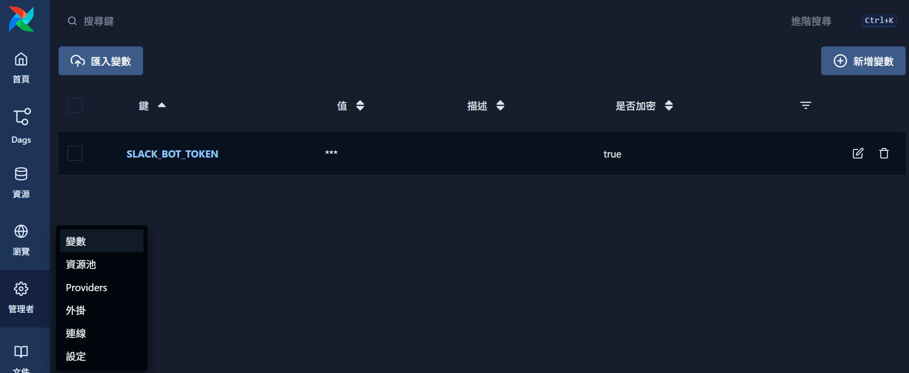

# Airflow 變數設定畫面

**2025.10.20**



上圖為 **Airflow UI** 中 [變數 (Variables)](https://airflow.apache.org/docs/apache-airflow/stable/core-concepts/variables.html) 頁面的設定範例。
在這裡可以建立全域變數，例如 Slack 機器人 Token、API Key、資料夾路徑等，以便在 DAG 中透過 `Variable.get()` 方法安全地讀取。

下圖中的例子設定了一個變數：

* **鍵 (Key)：** `SLACK_BOT_TOKEN`
* **值 (Value)：** Slack Bot 的存取 Token（已加密）
* **是否加密：** `true`

這些變數會儲存在 Airflow 的 metadata database 中，並在 UI 介面中以 `***` 隱藏顯示。

---

## 在 DAG 中引用 Airflow 變數

在 DAG 程式中可以使用 `from airflow.models import Variable` 來匯入 `Variable` 類別，並透過 `Variable.get()` 方法取得設定的值。例如：

```python
from airflow.models import Variable

slack_token = Variable.get("SLACK_BOT_TOKEN")
```

此範例示範如何安全地在 DAG 中讀取 `SLACK_BOT_TOKEN` 變數，以避免在程式碼中硬編 Token。
