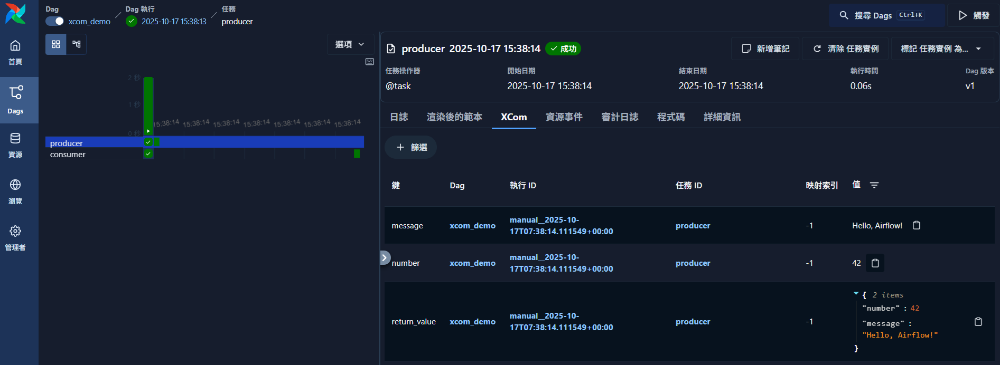

# Airflow XCom 與 Context / TaskInstance 完整教學

**2025.10.20**

[XCom（Cross-Communication）](https://airflow.apache.org/docs/apache-airflow/stable/core-concepts/xcoms.html)是 Apache Airflow 中讓任務（task）之間傳遞資料的機制。要真正理解它，必須同時掌握 `**context` 與 `ti = context['ti']` 的運作原理。本文整合兩者，完整示範自動與手動的 XCom 傳遞、以及底層 TaskInstance 的概念。

---

## 🧩 一、XCom 概念與結構

每筆 XCom 都會存放於 Airflow Metadata Database（通常是 `xcom` 資料表）中，包含以下欄位：

| 欄位名稱      | 說明           |
| --------- | ------------ |
| `key`     | 資料的名稱（識別字）   |
| `value`   | 序列化後儲存的任務回傳值 |
| `task_id` | 該資料來源的任務 ID  |
| `dag_id`  | 所屬 DAG       |
| `run_id`  | 所屬 DAG Run   |

> ✅ 建議只用 XCom 傳遞「小型資料」，例如數字、字串或小型字典。大型物件（例如 DataFrame、圖片、CSV）應改以外部儲存系統（如 S3、PostgreSQL）存取。

---

## 💡 二、自動傳遞：TaskFlow API 範例

```python
from airflow.sdk import dag, task
from typing import Dict, Any

@dag(
    description="Demonstrate XCom communication between tasks.",
    tags=["basic", "xcom"],
)
def xcom_demo():
    """DAG 主體：展示 XCom 自動傳遞任務結果的機制。"""

    @task
    def producer() -> Dict[str, Any]:
        """上游任務：建立字典資料並回傳。"""
        number = 42
        message = "Hello, Airflow!"
        print(f"[producer] Generated: number={number}, message='{message}'")
        return {"number": number, "message": message}

    @task
    def consumer(payload: Dict[str, Any]):
        """下游任務：接收上游的回傳資料並輸出內容。"""
        print(f"[consumer] number = {payload['number']}")
        print(f"[consumer] message = {payload['message']}")

    result = producer()  # 上游自動回傳 XComArg
    consumer(result)     # 下游自動取用 XCom 值

xcom_demo()
```



**機制說明：**

* `producer()` 回傳值自動以 `key='return_value'` 儲存在 XCom。
* 下游任務 `consumer()` 會自動從 XCom 拉取這個結果，作為輸入參數。

**優點：**

* 無需手動 `xcom_push()` / `xcom_pull()`。
* 程式碼結構清晰，推薦於 Airflow 2.0 以上版本使用。

---

## ⚙️ 三、手動傳遞：`xcom_push()` / `xcom_pull()`

當你使用傳統 Operator（例如 `PythonOperator`）或需要更靈活控制時，可以手動操作 XCom。

```python
from airflow.operators.python import PythonOperator
from airflow import DAG
from datetime import datetime

def push_task(**context):
    ti = context['ti']  # TaskInstance 物件
    ti.xcom_push(key='greeting', value='Hello from manual XCom!')
    print("[push_task] XCom pushed: key='greeting'")

def pull_task(**context):
    ti = context['ti']
    value = ti.xcom_pull(key='greeting', task_ids='push_task')
    print(f"[pull_task] Pulled value = {value}")

dag = DAG(
    dag_id='xcom_manual_demo',
    start_date=datetime(2025, 1, 1),
    schedule=None,
    catchup=False,
)

push = PythonOperator(
    task_id='push_task',
    python_callable=push_task,
    provide_context=True,
    dag=dag,
)

pull = PythonOperator(
    task_id='pull_task',
    python_callable=pull_task,
    provide_context=True,
    dag=dag,
)

push >> pull
```

**關鍵重點：**

* `context['ti']`：代表目前任務的 **TaskInstance**，[詳細文檔](https://airflow.apache.org/docs/apache-airflow/stable/core-concepts/xcoms.html#xcoms)。
* `ti.xcom_push(key, value)`：將資料推送進 XCom。
* `ti.xcom_pull(key, task_ids)`：從特定任務取出對應 key 的資料。

---

## 🧠 四、`**context` 與 `ti = context['ti']` 的概念

### 1️⃣ `context` 是什麼？

在 Airflow 任務執行時，系統會自動建立一個 **執行上下文（Execution Context）** 並傳入任務函式。它是一個 Python 字典，包含所有當前任務執行的環境資訊，例如：

| 鍵名             | 說明                      |
| -------------- | ----------------------- |
| `dag`          | 當前 DAG 物件               |
| `task`         | 當前任務物件                  |
| `ti`           | **TaskInstance 物件（重點）** |
| `ds`           | 執行日期（字串格式）              |
| `run_id`       | DAG Run 的唯一識別碼          |
| `logical_date` | 任務邏輯執行時間                |

若想觀察內容，可在任務中印出：

```python
def show_context(**context):
    from pprint import pprint
    pprint(context)
```

---

### 2️⃣ `**context` 與 `context` 的差異

| 寫法                       | 結果                                                           | 是否建議   |
| ------------------------ | ------------------------------------------------------------ | ------ |
| `def my_func(**context)` | 正確接收 Airflow 傳入的所有環境參數                                       | ✅ 建議使用 |
| `def my_func(context)`   | 可能報錯：`TypeError: got multiple values for argument 'context'` | ⚠️ 不建議 |

Airflow 執行任務時，會以 `python_callable(**context)` 方式呼叫。若函式定義沒用 `**`，Python 會將這些關鍵字參數誤認為位置參數而導致衝突。

---

### 3️⃣ `ti = context['ti']` 是什麼？

`ti` 是從 context 取出的 **TaskInstance**（任務實例）物件。它代表某個任務在某次執行（DAG Run）中的具體實例。可用來操作任務的內部行為，如：

| 方法                            | 功能                           |
| ----------------------------- | ---------------------------- |
| `ti.xcom_push(key, value)`    | 將資料推送到 XCom                  |
| `ti.xcom_pull(key, task_ids)` | 從其他任務取資料                     |
| `ti.state`                    | 查看任務狀態（`success` / `failed`） |
| `ti.task_id`                  | 取得任務 ID                      |
| `ti.try_number`               | 當前重試次數                       |

範例：

```python
def push_task(**context):
    ti = context['ti']
    ti.xcom_push(key='msg', value='Hello!')

def pull_task(**context):
    ti = context['ti']
    value = ti.xcom_pull(key='msg', task_ids='push_task')
    print(f"[pull_task] got = {value}")
```

---

## 🧮 五、常見使用情境

| 情境         | 解法                                              |
| ---------- | ----------------------------------------------- |
| 自動任務串接     | TaskFlow API，自動回傳值傳遞                            |
| 多值傳遞       | 多個 `xcom_push()` 設不同 key                        |
| 彙整多任務結果    | `[ti.xcom_pull(task_ids=t) for t in task_list]` |
| 跨 DAG 共享資料 | 改用資料庫或外部儲存（非 XCom）                              |

---

## 🔍 六、UI 觀察 XCom

1. 在 Airflow Web UI 打開 **DAG → Task Instance → XComs**。
2. 可看到每筆 `key`、`value`、`timestamp`、`task_id`。
3. JSON 結構會自動格式化，方便閱讀與除錯。

---

## ⚙️ 七、實務建議

✅ 建議：

* 一律使用 `def my_func(**context)` 接收執行上下文。
* 使用 `ti.xcom_push()` / `xcom_pull()` 時，僅傳遞 metadata 或輕量資料。
* key 命名保持一致（例如：`model_path`、`summary_json`）。

⚠️ 避免：

* 在高頻任務中頻繁 push/pull，造成 Metadata DB 壓力。
* 傳遞大型物件（如 DataFrame、影像檔）。

---

## 🧠 八、關係圖總覽

```
DAG Run
 └── TaskInstance (ti)
       ├── 執行任務函式 (python_callable(**context))
       │      └── context['ti'] → 指向當前任務實例
       └── XCom push/pull → 與其他任務交換資料
```

---

> ✅ **總結：**
>
> * `**context` 是 Airflow 自動注入的環境變數包。
> * `ti = context['ti']` 取得當前任務實例以操作 XCom。
> * TaskFlow API 適合一般情境；傳統 `PythonOperator` + `context` 適合需要手動控制的進階任務。
