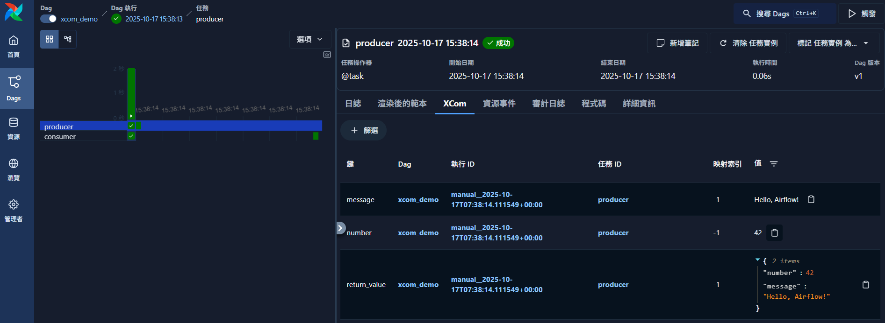

# Airflow XCom 機制完整教學

XCom（Cross-Communication）是 Apache Airflow 中讓任務（task）之間傳遞資料的機制。本文將以 **自動傳遞（TaskFlow API）** 與 **手動傳遞（ti.xcom_push / ti.xcom_pull）** 兩種方式，完整示範 XCom 的使用情境與最佳實踐。

---

## 🧩 一、XCom 概念與結構

每筆 XCom 都會存放於 Airflow Metadata Database（通常是 `xcom` 資料表）中，包含以下欄位：

| 欄位名稱      | 說明           |
| --------- | ------------ |
| `key`     | 資料的名稱（識別字）   |
| `value`   | 序列化後儲存的任務回傳值 |
| `task_id` | 該資料來源的任務 ID  |
| `dag_id`  | 所屬 DAG       |
| `run_id`  | 所屬 DAG Run   |

> ✅ 建議只用 XCom 傳遞「小型資料」，例如數字、字串或小型字典。大型物件（例如 DataFrame、圖片、CSV）應改以外部儲存系統（如 S3、PostgreSQL）存取。

---

## 💡 二、自動傳遞：TaskFlow API 範例

```python
from airflow.sdk import dag, task
from typing import Dict, Any

@dag(
    description="Demonstrate XCom communication between tasks.",
    tags=["basic", "xcom"],
)
def xcom_demo():
    """DAG 主體：展示 XCom 自動傳遞任務結果的機制。"""

    @task
    def producer() -> Dict[str, Any]:
        """上游任務：建立字典資料並回傳。"""
        number = 42
        message = "Hello, Airflow!"
        print(f"[producer] Generated: number={number}, message='{message}'")
        return {"number": number, "message": message}

    @task
    def consumer(payload: Dict[str, Any]):
        """下游任務：接收上游的回傳資料並輸出內容。"""
        print(f"[consumer] number = {payload['number']}")
        print(f"[consumer] message = {payload['message']}")

    result = producer()  # 上游自動回傳 XComArg
    consumer(result)     # 下游自動取用 XCom 值

xcom_demo()
```



**機制說明：**

* `producer()` 回傳值自動以 `key='return_value'` 儲存在 XCom。
* 下游任務 `consumer()` 會自動從 XCom 拉取這個結果，作為輸入參數。

**優點：**

* 無需手動 `xcom_push()` / `xcom_pull()`。
* 程式碼結構清晰，推薦於 Airflow 2.0 以上版本使用。

---

## ⚙️ 三、手動傳遞：`xcom_push()` / `xcom_pull()`

當你使用傳統 Operator（例如 `PythonOperator`）或需要更靈活控制時，可以手動操作 XCom。

```python
from airflow.operators.python import PythonOperator
from airflow import DAG
from datetime import datetime

def push_task(**context):
    ti = context['ti']  # TaskInstance 物件
    ti.xcom_push(key='greeting', value='Hello from manual XCom!')
    print("[push_task] XCom pushed: key='greeting'")

def pull_task(**context):
    ti = context['ti']
    value = ti.xcom_pull(key='greeting', task_ids='push_task')
    print(f"[pull_task] Pulled value = {value}")

dag = DAG(
    dag_id='xcom_manual_demo',
    start_date=datetime(2025, 1, 1),
    schedule=None,
    catchup=False,
)

push = PythonOperator(
    task_id='push_task',
    python_callable=push_task,
    provide_context=True,
    dag=dag,
)

pull = PythonOperator(
    task_id='pull_task',
    python_callable=pull_task,
    provide_context=True,
    dag=dag,
)

push >> pull
```

**關鍵重點：**

* `context['ti']`：代表目前任務的 **TaskInstance**。
* `ti.xcom_push(key, value)`：將資料推送進 XCom。
* `ti.xcom_pull(key, task_ids)`：從特定任務取出對應 key 的資料。

---

## 🧠 四、常見使用情境

| 情境         | 解法                                                       |
| ---------- | -------------------------------------------------------- |
| 自動任務串接     | 使用 TaskFlow API，讓上游回傳值直接傳遞給下游                            |
| 需要多值傳遞     | 使用多個 `xcom_push()` 設不同 key                               |
| 彙整多任務輸出    | `values = [ti.xcom_pull(task_ids=t) for t in task_list]` |
| 跨 DAG 資料交換 | 不建議，改用資料庫或外部儲存                                           |

---

## 🔍 五、UI 觀察 XCom

可在 Airflow Web UI 中查看 XCom 紀錄：

1. 開啟 **DAGs → Task Instance → XComs** 分頁。
2. 可看到每筆 `key`、`value`、`timestamp` 等詳細內容。
3. 若資料為 JSON 結構，UI 可自動格式化呈現。

---

## 💡 六、最佳實踐

✅ 建議：

* XCom 僅用於傳遞 metadata 或輕量內容。
* key 命名統一，例如 `model_path`、`summary_json`、`status_flag`。
* 避免在回傳值中包含 Pandas DataFrame、影像、CSV 等大型物件。

⚠️ 避免：

* 在高頻任務中大量 push/pull，會增加 Metadata DB 負擔。
* 多層嵌套 dict 結構，導致後續維護困難。

---

> ✅ **總結：** 透過 XCom，Airflow 讓任務間能進行輕量的資料傳遞。TaskFlow API 適合一般情境，而手動 `ti.xcom_push()` / `xcom_pull()` 則適合進階與自訂任務控制。
